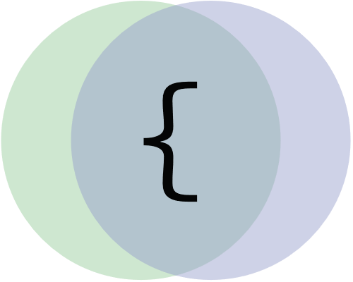

<div align="center">
  
  <h1>diffler</h1>
  <p>
    <b>A recursive JSON comparison script for humans</b>
  </p>
  <br>
  <br>
</div>

## Motivation

To compare JSON objects containing asset metadata for a digital library. Upon change of any metadata, we'd store these changes as an audit trail and email asset stakeholders for review and approval of the changes.

## Dependencies

diffler is written with Node v12 in mind.
Tests depend on [Mocha](https://mochajs.org/).

## Usage

[](https://www.npmjs.com/package/diffler)

```bash
npm install diffler
```

### Params

`obj1` and `obj2` are two JSON objects for comparison.

### Return

If same: returns `{}` _(empty object)_

If different: A JSON object with preserved path structure. The resulting values will be an object with `from` and `to` fields.

### Example

```js
const diffler = require("diffler");

const before = { name: "omgaz", location: "London" };
const after = { name: "omgaz", location: "Melbourne" };

const difference = diffler(before, after);
console.log(difference); // { location: { from: "London", to: "Melbourne" } }
```

## Tests

[](https://travis-ci.org/omgaz/diffler)

If you'd like to run tests, check out the whole project. You'll need NodeJS installed. Tests use Mocha.

```bash
  npm install
  npm test
```
