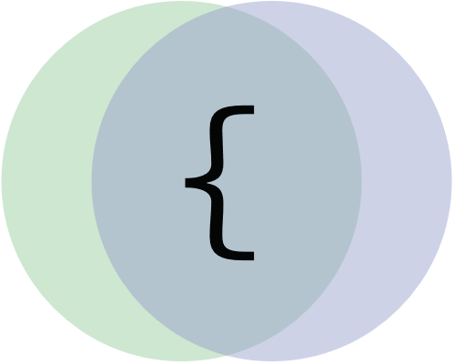

<div align="center">
  
  <h1>diffler</h1>
  <p>
    <b>A recursive JSON comparison script for humans</b>
  </p>
  <br>
  <br>
</div>

## Motivation

To compare JSON objects containing asset metadata for a digital library. Upon change of any metadata, we'd store these changes as an audit trail and email asset stakeholders for review and approval of the changes.

## Usage

[](https://www.npmjs.com/package/diffler)

```bash
npm install diffler
```

### Params

`original` and `updated` are two JSON objects for comparison.

### Return

If same: returns `{}` _(empty object)_

If different: A JSON object with preserved path structure. The resulting values will be an object with `from` and `to` fields.

### Example

#### ESM

```ts
import diffler from 'diffler';

const before = { name: 'omgaz', location: 'London' };
const after = { name: 'omgaz', location: 'Melbourne' };

const difference = diffler(before, after);
console.log(difference); // { location: { from: 'London', to: 'Melbourne' } }
```

#### CommonJS

```js
const diffler = require('diffler');

const before = { name: 'omgaz', location: 'London' };
const after = { name: 'omgaz', location: 'Melbourne' };

const difference = diffler(before, after);
console.log(difference); // { location: { from: 'London', to: 'Melbourne' } }
```

## Development

Requires Node 18+.

```bash
npm install
npm test
npm run build
```

### Scripts

| Command               | Description                   |
| --------------------- | ----------------------------- |
| `npm test`            | Run tests with Vitest         |
| `npm run test:terse`  | Run tests with minimal output |
| `npm run test:watch`  | Run tests in watch mode       |
| `npm run lint`        | Check with Biome              |
| `npm run lint:fix`    | Auto-fix with Biome           |
| `npm run check-types` | TypeScript type checking      |
| `npm run build`       | Build with Vite               |
| `npm run bench`       | Run performance benchmark     |
